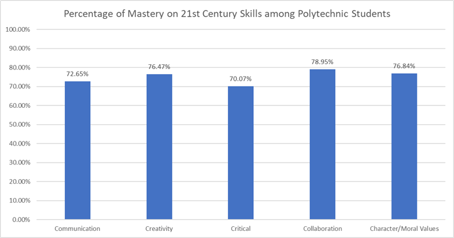
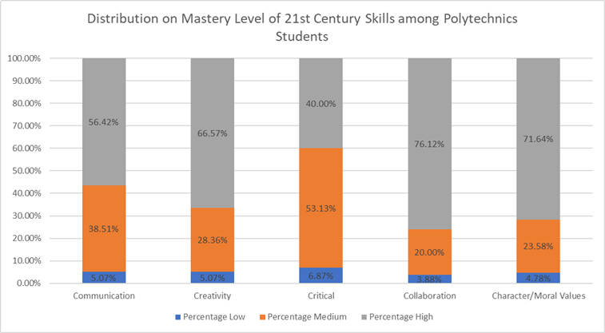
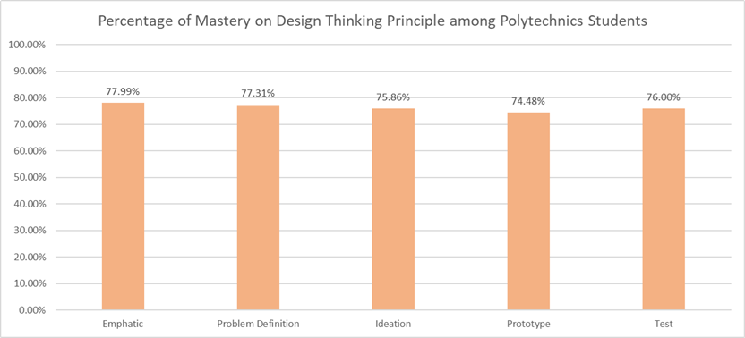
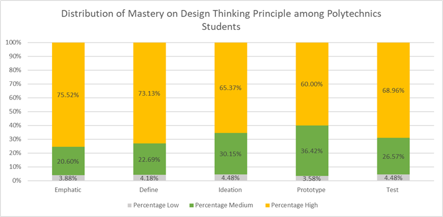

# Data Analyst Portfolio

## About Me

Mechanical / Maintenance / Automation Engineer transitioning into Data Analytics with experience in manufacturing operations, maintenance KPI monitoring, and operational reporting.

Currently learning and building practical skills in:

* SQL
* Power BI
* Excel Analytics
* Data Visualization

My goal is to transition into a Data Analyst / Reporting Analyst role within manufacturing, operations, or business analytics environments.

---

# Current Technical Skills

## Excel

* Pivot Table & Pivot Chart
* VLOOKUP / XLOOKUP
* Data Cleaning
* Graph Plotting
* Conditional Formatting
* KPI Reporting

## SQL

Currently learning and practicing:

* SELECT
* DISTINCT
* Aggregate Functions
* WHERE
* GROUP BY
* HAVING
* JOIN
* ORDER BY
* LIMIT & OFFSET

## Power BI

Currently learning:

* Dashboard Visualization
* KPI Cards
* Data Modeling
* Data Cleaning
* Interactive Reporting

---

# Featured Projects

## 1. Master's Project — The Relationship of Design Thinking with 21st Century Learning Skills Amongst Students of Engineering Programs in Malaysia Polytechnics  (Universiti Teknologi Malaysia,2021)

### Project Overview

Investigate whether Design Thinking process correlates with 21st century learning skills among Malaysian polytechnic engineering students.

### Key Contributions

* Data collection and analysis consists of 337 respondent
* Likert-scale questionnaire
* Operational efficiency observations

### Skills Used

* IBM SPSS
* Statistical analysis
* Pearson Correlation
* Descriptive statistics
* Data visualization

### Key Findings
* Critical thinking skills scored only medium level, but still satisfactory.
* Collaboration skills is the highest among all dimensions.
* Strong positive correlation between Design Thinking principle and 21st century learning skills.

### Business/Education Implication
TVET institutions may improve employability skills by integrating Design Thinking practices into curriculum.

### Summary of Thesis

* Data visualisation:

#### Bar Chart of 21st Century Skills level among Polythecnics Students
  
*The highest level is collaboration skills, while the lowest level is critical thinking. All dimensions is above 70%.* 
 
 
*Most of the students are still in medium level of critical thinking, which improvement can be made to ensure high employability.* 
 

#### Bar Chart of Design Thinking level among Polythecnics Students
 
*The highest score is the implementation on emphatic process, while the lowest one is prototype process. All dimensions is above 74%.* 
 
 
*Most of the student has high udnerstanding on how to run emphatic process in Design Thinking.* 
 
* My [Article](Related Diagram/Article_Thesis_IzhamShah_MPP191024.pdf)

---

## 2. Boiler efficiency and shift performance (SD Guthrie International Langat Refinery,November 2021 - February 2022)

### Project Overview

Analyzed boiler production and plant steam consumption to calculate efficiency and evaluate as boilerman KPI.

### Key Contributions

* Data collection and analysis
* Performance trend monitoring
* Operational efficiency observations
* Report preparation and presentation

### Skills Used

* Excel
* Data Analysis
* Technical Reporting
* Industrial Operations Understanding

### Key Findings
* For steam production per natural gas consumption ratio, 

### Summary of Analysis

---

## 3. Maintenance Job Count & Repair Time Analysis (Porite Malaysia)

### Project Overview

Analyzed maintenance job frequency and repair duration trends to understand operational workload and maintenance efficiency.

### Key Contributions

* Job count analysis
* Repair duration analysis
* Trend identification
* Maintenance KPI observation

### Skills Used

* Excel
* Data Organization
* Maintenance KPI Analysis
* Manufacturing Operations

---

# Current Learning Journey

I am currently strengthening my technical skills in:

* SQL querying
* Power BI dashboard development
* Data storytelling
* Manufacturing analytics

Target:
Transition into a Junior Data Analyst / Reporting Analyst role before September 2026.

---

# Future Portfolio Projects

Planned upcoming projects:

* Maintenance KPI Dashboard
* Machine Downtime Analysis
* Production Efficiency Dashboard
* SQL Manufacturing Dataset Analysis

---

# Contact

## LinkedIn

[My Profile](https://www.linkedin.com/in/izham-shah-hamdan-5aabb4166/?lipi=urn%3Ali%3Apage%3Ad_flagship3_profile_view_base_contact_details%3BLLzmI20HRxuY1iSr39dZng%3D%3D)

## GitHub

[Portfolio](https://ejam96.github.io/Data_Analyst_Portfolio/)
