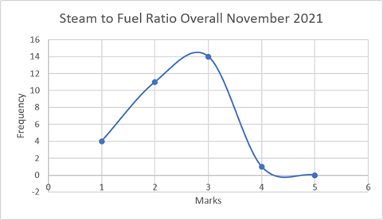
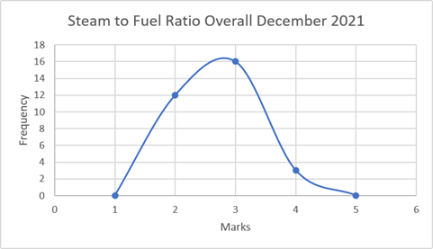
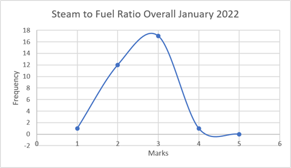
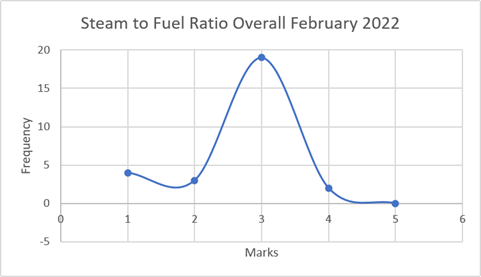
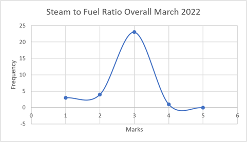
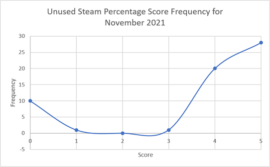

# Data Analyst Portfolio

## About Me

Mechanical / Maintenance / Automation Engineer transitioning into Data Analytics with experience in manufacturing operations, maintenance KPI monitoring, and operational reporting.

Currently learning and building practical skills in:

* SQL
* Power BI
* Excel Analytics
* Data Visualization

My goal is to transition into a Data Analyst / Reporting Analyst role within manufacturing, operations, or business analytics environments.

---

# Current Technical Skills

## Excel

* Pivot Table & Pivot Chart
* VLOOKUP / XLOOKUP
* Data Cleaning
* Graph Plotting
* Conditional Formatting
* KPI Reporting

## SQL

Currently learning and practicing:

* SELECT
* DISTINCT
* Aggregate Functions
* WHERE
* GROUP BY
* HAVING
* JOIN
* ORDER BY
* LIMIT & OFFSET

## Power BI

Currently learning:

* Dashboard Visualization
* KPI Cards
* Data Modeling
* Data Cleaning
* Interactive Reporting

---

# Featured Projects

## 1. Master's Project — The Relationship of Design Thinking with 21st Century Learning Skills Amongst Students of Engineering Programs in Malaysia Polytechnics  (Universiti Teknologi Malaysia,2021)

### Project Overview

Investigate whether Design Thinking process correlates with 21st century learning skills among Malaysian polytechnic engineering students.

### Key Contributions

* Data collection and analysis consists of 337 respondent
* Likert-scale questionnaire
* Operational efficiency observations

### Skills Used

* IBM SPSS
* Statistical analysis
* Pearson Correlation
* Descriptive statistics
* Data visualization

### Key Findings
* Critical thinking skills scored only medium level, but still satisfactory.
* Collaboration skills is the highest among all dimensions.
* Strong positive correlation between Design Thinking principle and 21st century learning skills.

### Business/Education Implication
TVET institutions may improve employability skills by integrating Design Thinking practices into curriculum.

### Summary of Thesis

* Data visualisation:

#### Bar Chart of 21st Century Skills level among Polythecnics Students
  
*The highest level is collaboration skills, while the lowest level is critical thinking. All dimensions is above 70%.* 
 
 
*Most of the students are still in medium level of critical thinking, which improvement can be made to ensure high employability.* 
 

#### Bar Chart of Design Thinking level among Polythecnics Students
 
*The highest score is the implementation on emphatic process, while the lowest one is prototype process. All dimensions is above 74%.* 
 
 
*Most of the student has high understanding on how to run emphatic process in Design Thinking.* 
 
* My [Article](Related Diagram/Article_Thesis_IzhamShah_MPP191024.pdf)

---

## 2. Steam generation performance evaluation (SD Guthrie International Langat Refinery,November 2021 - February 2022)

### Project Overview

Analyzed steam generation performance by developing a steam-to-fuel consumption KPI in Microsoft Excel, included with steam usage percentage, and monitoring monthly trends to support energy efficiency evaluation and utility performance reporting.

### Key Contributions

* Data collection and analysis
* Performance trend monitoring
* Operational efficiency observations
* Report preparation and presentation

### Skills Used

* Excel
* Data Analysis
* Technical Reporting
* Industrial Operations Understanding

### Key Findings
* For steam production (kg) per natural gas consumption (Sm^3) ratio, usually can be achieved with ratio of 11.00 till 14.00. Thus, we can classified 11.00 is the lowest score and 14.00 is the highest score:

|Class Interval|Remarks             |
|:------------:|:------------------:|
|11.00 – 11.60 |Very Low Efficiency |
|11.60 – 12.20 |Low Efficiency      |
|12.20 – 12.80 |Medium Efficiency   |
|12.80 – 13.40 |High Efficiency     |
|13.40 – 14.00 |Very High Efficiency|

#### From November 2021 till December 2021, the highest ratio achieved is 13.21 while the lowest one is 11.32:
* November 2021: Most of the ratio can be achieved by 12.20 – 12.80, which is medium energy efficiency.
* December 2021: Most of the ratio can be achieved by 12.20 – 12.80, which is medium energy efficiency.

 
   
 

#### For January 2022 till March 2022, the highest ratio achieved is 13.38 while the lowest one is 11.01:
* January 2022: Most of the ratio can be achieved by 12.20 – 12.80, which is medium energy efficiency.
* February 2022: Most of the ratio can be achieved by 12.20 – 12.80, which is medium energy efficiency.
* March 2022: Most of the ratio can be achieved by 12.20 – 12.80, which is medium energy efficiency.

 

 

 

#### By summary, steam to fuel ratio of all 3 boilers of SD Guthrie International Langat Refinery is consistently produce medium level of efficiency by normal distribution as above graph showns. This can be improved more by utilising deaerator as to increase water temperature with less gas consumption.

* For steam balance percentage, it is identified by obtaining boiler steam production, and then obtaining steam net balance by including plant steam usage shown at totaliser. The target/range of steam balance percentage is as below:

|Class Interval|Remarks             |Score|
|:------------:|:------------------:|:---:|
|<0%           |Error Data          |0    |
|20% – 100%    |Very Low Efficiency |1    |
|15% – 20%     |Low Efficiency      |2    |
|10% – 15%     |Medium Efficiency   |3    |
|5% – 10%      |High Efficiency     |4    |
|0% – 5%       |Very High Efficiency|5    |

#### For November 2021, the highest percentage achieved is 26.51% while the lowest one is 0.44%:
 
 

#### By summary, unused steam percentage of SD Guthrie International Langat Refinery shows consistency at score 5, which we can say that most of the shift can managed to reduce steam losses due to good steamline condition |very high efficiency|, which has no severe leaks throughout line. This can be improved more by ensure proper condensate water return to boiler system for reducing more steam/water losses.

---

## 3. Maintenance Job Count & Repair Time Analysis (Porite Malaysia)

### Project Overview

Analyzed maintenance job frequency and repair duration trends to understand operational workload and maintenance efficiency.

### Key Contributions

* Job count analysis
* Repair duration analysis
* Trend identification
* Maintenance KPI observation

### Skills Used

* Excel
* Data Organization
* Maintenance KPI Analysis
* Manufacturing Operations

---

# Current Learning Journey

I am currently strengthening my technical skills in:

* SQL querying
* Power BI dashboard development
* Data storytelling
* Manufacturing analytics

Target:
Transition into a Junior Data Analyst / Reporting Analyst role before September 2026.

---

# Future Portfolio Projects

Planned upcoming projects for learning purposes:

* Maintenance KPI Dashboard
* Machine Downtime Analysis with Power BI
* SQL Manufacturing Dataset Analysis

---

# Contact

## LinkedIn

[My Profile](https://www.linkedin.com/in/izham-shah-hamdan-5aabb4166/?lipi=urn%3Ali%3Apage%3Ad_flagship3_profile_view_base_contact_details%3BLLzmI20HRxuY1iSr39dZng%3D%3D)

## GitHub

[Portfolio](https://ejam96.github.io/Data_Analyst_Portfolio/)
